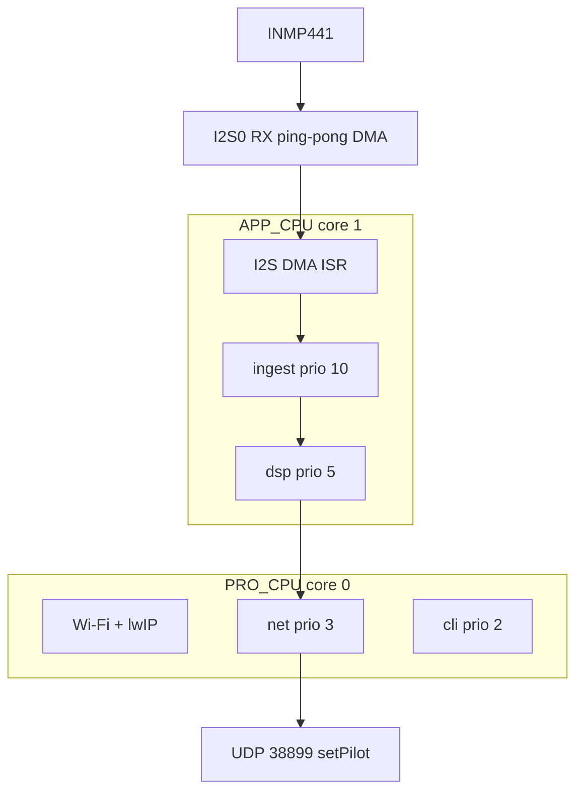

# Firmware notes

Build, flash, wiring, runtime architecture, CLI, power, and training for [Jarvis Jr](../README.md). This is ESP-IDF C via PlatformIO (`framework = espidf`). There is no Arduino framework and no cloud API.

## Contents

- [Requirements](#requirements)
- [Clone and build](#clone-and-build)
- [USB and COM ports](#usb-and-com-ports)
- [First IDF flash](#first-idf-flash)
- [Microphone wiring](#microphone-wiring)
- [Runtime architecture](#runtime-architecture)
- [Product state machine](#product-state-machine)
- [Power and light sleep](#power-and-light-sleep)
- [Wi-Fi and WiZ](#wi-fi-and-wiz)
- [Serial CLI](#serial-cli)
- [Detection knobs](#detection-knobs)
- [Training command models](#training-command-models)
- [Repository layout](#repository-layout)
- [Debugging](#debugging)

## Requirements

- Waveshare ESP32-S3-Nano (ESP32-S3R8): dual-core Xtensa LX7, 8 MB in-package octal PSRAM, 16 MB flash, native USB-C (USB Serial/JTAG). This is the only PlatformIO env (`[env:esp32-s3-nano]`, `board = arduino_nano_esp32`).
- INMP441 microphone, left channel (L/R to GND).
- Optional: WiZ bulb on the same LAN, with **Settings → Security → Allow Local → Allow all controls** (unsigned JSON is rejected on recent firmware otherwise).
- [PlatformIO Core](https://docs.platformio.org/en/latest/core/installation.html) (`pio`). On Windows, if `pio` is missing:

```powershell
& "$env:USERPROFILE\.platformio\penv\Scripts\pio.exe" --version
```

Use that path in place of `pio`, or restart the terminal after installing PlatformIO.

The factory app partition is **4 MB** (`partitions.csv`). TFLite Micro does not fit the default 1 MB app. Compiling TFLM with one `cc1plus` per CPU core will freeze this PC (`out of memory allocating …`). The project caps SCons at **2 jobs** (`scripts/limit_jobs.py`). Still pass `-j 2` at the CLI so PlatformIO itself does not spawn a wide SCons graph. Do not raise parallelism.

## Clone and build

```text
git clone --recurse-submodules <this-repo>
cd Jarvis-Jr
pio run -j 2
```

If you already cloned without submodules:

```text
git submodule update --init --recursive
```

| Command | What it does |
|---|---|
| `pio --version` | Toolchain is on PATH |
| `pio device list` | USB COM ports Windows assigned |
| `pio run -j 2` | Compile only |
| `pio run -j 2 -t upload` | Compile and flash |
| `pio device monitor` | Serial logs at 115200 |
| `pio run -j 2 -t upload -t monitor` | Flash, then open serial |
| `pio run -t clean` | Wipe build objects |
| `pio run -t fullclean` | Rebuild CMake + sdkconfig from defaults |

Leave the monitor with **Ctrl+C**. Close it before upload; the port is exclusive. Do not tap RST while the monitor is open (USB Serial/JTAG drops). After changing `sdkconfig.defaults` or `sdkconfig.defaults.esp32s3`, run `pio run -t fullclean` then `pio run -j 2`.

Set `upload_port` / `monitor_port` in `platformio.ini` to the current `303A` COM from `pio device list`. COM numbers move between machines.

Expect the boot banner `CPU Cores: 2` and **non-zero** `External PSRAM` (8 MB). Healthy command-model boot logs `light_on` and `light_off`, not `cmd models: none`.

### sdkconfig

| File | Role |
|---|---|
| `sdkconfig.defaults` | Tickless idle, `CONFIG_PM_ENABLE`, PM profiling, USB Serial/JTAG no-auto-light-sleep |
| `sdkconfig.defaults.esp32s3` | 16 MB QIO flash, octal PSRAM, USB Serial/JTAG console, custom `partitions.csv` |

PlatformIO generates `sdkconfig.esp32-s3-nano` locally; it is gitignored. `board_build.f_cpu` in `platformio.ini` is not what IDF uses; CPU max is `CONFIG_ESP_DEFAULT_CPU_FREQ_MHZ` (160).

## USB and COM ports

Factory USB is Arduino CDC **`2341:0070`**. **esptool cannot flash that.** Opening that COM at 1200 baud puts the board in Arduino DFU (the COM disappears). Recover: unplug, wait, plug back in. Do not flash `2341:0070`. Do not double-tap RST.

| VID:PID | What it is | Use with esptool? |
|---|---|---|
| `2341:0070` | Arduino CDC (factory) | **No** |
| `303A:1001` | ESP32 ROM download | **Yes — first IDF flash** |
| `303A:4001` | This firmware’s USB Serial/JTAG | Monitor and later uploads |
| `BTHENUM` | Bluetooth | Never |

There is no BOOT button. **B1** (GPIO0) is on the **3V3 / VUSB** side of the header.

Windows USB Serial/JTAG requires `monitor_rts = 0` and `monitor_dtr = 0` in `platformio.ini`. Leaving RTS/DTR on resets the chip and kills the COM port.

## First IDF flash

Already done if this board has been running this firmware. Keep the sequence for a factory Arduino image or a brick:

1. Close the serial monitor. Unplug/replug if USB is stuck.
2. Jumper **B1 (GPIO0)** to GND. RGB should go **green**.
3. Tap **RST** while the jumper is on.
4. **Remove the jumper**. RGB should stay **purple**.
5. `pio device list` → **`303A:1001`** (ROM download). Set `upload_port` / `monitor_port` to that COM.
6. `pio run -j 2 -t upload`, then tap RST so the app starts.

If a later upload fails, the same jumper sequence puts the chip back in ROM download.

## Microphone wiring

INMP441 on the S3-Nano:

| Mic | GPIO | Header |
|---|---|---|
| SCK (BCLK) | 10 | D7 |
| WS | 17 | D8 |
| SD | 21 | D10 |
| VDD | — | 3V3 |
| GND, L/R | — | GND (left channel) |

User LED is **GPIO 48 / D13**, on only during the Hey Jarvis listen window. DSP owns the pin. Ingest does not initialize or drive it.

## Runtime architecture

`app_main` prints cores + PSRAM size, then starts **power → dsp → ingest → cli → net** and returns.



### Audio ingest

- I2S0 master RX, IDF 6 `driver/i2s_std.h`: Philips 32-bit, 16 kHz, mono left, ping-pong DMA (`dma_desc_num = 2`, `dma_frame_num = 512` → ~32 ms/block).
- `on_recv` ISR (IRAM): store DMA pointer + size, give a binary semaphore. If the previous pointer is still set, increment `ovf`. The ISR stays tiny. The firmware does not call `i2s_channel_read()`.
- Ingest task on APP_CPU, priority 10: wait on the semaphore, shift samples `>> 8` for DC/AC VAD only.
- VAD: skip ~0.5 s of I2S clock-start transient (`VAD_BOOT_SKIP_BLOCKS = 16`), then ~0.5 s boot learn (`VAD_BOOT_BLOCKS = 16`; boot log prints `VAD floor learned=`). Then voice if `ac_mean_sq > VAD_RATIO_K * noise` (`K = 3`). Quiet blocks slowly update the floor. Hangover 8 blocks (~256 ms) so a pause inside a phrase is not dropped.
- Submit to DSP if `listening || voiced || hangover`. During the listen window every block is submitted.

Healthy idle ingest: `ovf=0`, `qdrop=0`, `period_us` ~32000.

### DSP and models

DSP task, priority 5, APP_CPU, stack 8192:

- Pool / queues: `AUDIO_DSP_QUEUE_LEN = 8` (~256 ms). Listen submits every 32 ms.
- `audio_dsp_try_submit`: I2S `>> 16` then saturating `* AUDIO_PCM_GAIN` (4) → int16.
- Integer TFLM microfrontend (40 mel, 30 ms / 10 ms, noise reduction + PCAN + log). Quantize `uint16 → int8` like ESPHome.
- Three streaming INT8 slots in `components/wake_model/wake_model.cc`. Arenas in internal SRAM (`WAKE_ARENA_IN_PSRAM 0`, 48 KB each). Interpreters are function-static (TFLM example pattern), not placement `new`.
- Idle: only Jarvis. Listen: only command slots. A gap >1 s in idle resets Jarvis + the frontend.
- Detection: sliding-window average ≥ cutoff. Jarvis window 5; command window 3.

CMake embeds `models/light_on.tflite` and `models/light_off.tflite` when those paths exist at configure time. Compile log should mention embedding both. If boot says `cmd models: none`, `pio run -t fullclean` then `pio run -j 2`. Generated `*_model.c` files are gitignored.

Do not mix `.cc` into `src/` (leaks `-fuse-cxa-atexit` onto C compiles). The only first-party C++ is `components/wake_model/wake_model.cc`.

## Product state machine

1. **Idle:** VAD-gated 32 ms blocks; only `hey_jarvis` runs. LED off. Bulb unchanged.
2. **Hey Jarvis hit:** GPIO 48 ON, open a 3 s listen window (`WAKE_LISTEN_US`). Does **not** toggle the bulb. Jarvis is not re-run in this window.
3. **Listen:** ingest submits every block (VAD bypassed). Only `light_on` / `light_off` run.
4. **Command hit:** `net_set_light(true/false)`, LED off, return to idle (Jarvis cooldown).
5. **Timeout:** LED off, no bulb change.

CLI `wiz on|off` still works and does not need the listen window.

## Power and light sleep

Tickless idle is on. `power_init()` (`src/power_management/power.c`) calls `esp_pm_configure()` with CPU max 160 MHz, min 40 MHz (XTAL), and `light_sleep_enable = true`.

The firmware never calls `esp_light_sleep_start()` itself. Light sleep is entered from FreeRTOS idle (`vApplicationSleep`) **only when every PM lock is released**.

While I2S is enabled, the IDF I2S driver holds `ESP_PM_APB_FREQ_MAX`, which keeps the PLL up and **blocks light sleep**. That is required: S3 light sleep clock-gates I2S/GDMA, so the mic cannot stream through sleep.

After `DOZE_AFTER_MS` (30 s) without **sustained** VAD, ingest **disables** the I2S channel, `vTaskDelay`s `DOZE_SLEEP_MS` (500 ms), then re-enables. Clock-start AC is tens of times the quiet floor, then a ~3× tail that looks like speech if VAD runs immediately. After a timed discard, ingest waits until AC is below `DOZE_SETTLED_K` (2) × the pre-doze floor (`DOZE_SETTLE_QUIET` near-floor blocks; one in-band blip decrements, it does not zero the run; glitches are skipped). Then ~1 s of VAD. `DOZE_VOICE_BLOCKS` (6) in-band hits anywhere in that window leave doze; they are **not** required to be consecutive, because syllable gaps in “Hey Jarvis” drop below K×floor every few blocks (a spoken probe logs `hits=7–9/32`, a quiet room `hits=0–2/32`). Probe audio is not submitted to DSP. Settle timeout → stay in doze.

VAD hangover still feeds DSP so a pause inside “Hey Jarvis” is not dropped. It does **not** gate doze. The 30 s clock (`quiet_ms`) resets when DSP is in its listen window (wake word fired), or on a **voiced** block when `DOZE_ARM_BLOCKS` (12) of the last 32 blocks (~1 s) were VAD hits. Stamping on every block while the window was full left `quiet_ms=0` for a second after the room went quiet. DMA glitches do not count. A successful “Hey Jarvis” always resets via the listen window; a short utterance that does not reach 12 hits will not.

Knobs: `include/audio_ingest.h` (`DOZE_AFTER_MS`, `DOZE_SLEEP_MS`, `DOZE_SETTLED_K`, `DOZE_ARM_BLOCKS`, `DOZE_GLITCH_K`).

`stats` `doze_en` is the `pm doze on|off` switch. `dozing` is 1 only while I2S is actually stopped. `quiet_ms` is the doze clock; it should climb toward 30000 in a quiet room.

Other locks:

| Lock | Who | Effect |
|---|---|---|
| `ESP_PM_CPU_FREQ_MAX` (`dsp`) | Held only while DSP processes a block | Inference at 160 MHz |
| `ESP_PM_APB_FREQ_MAX` (`i2s_driver`) | Held while the RX channel is enabled | Blocks light sleep |
| `ESP_PM_NO_LIGHT_SLEEP` (`usb_serial_jtag`) | Held while a USB host is attached (`CONFIG_USJ_NO_AUTO_LS_ON_CONNECTION`) | Serial stays up; no light sleep |

USB Serial/JTAG cannot remain enumerated through S3 light sleep. With a PC attached, doze still stops I2S, but the idle task will not enter light sleep. To observe real sleep: close the monitor, unplug PC USB, power from a wall charger (not a power bank — low-current cutoff), wait a couple of minutes, re-plug, run `pm`. Expect `light_sleep_counts > 0`. If COM does not come back, tap RST with the monitor closed.

Do not quote milliamp numbers until they are measured on the board.

Wi-Fi uses `WIFI_PS_MIN_MODEM`, so the chip still wakes on DTIM beacons. Sleep savings are bounded by the AP beacon interval. If UDP to the bulb gets flaky, the knob is `NET_WIFI_PS` in `include/net.h`.

The first **Hey Jarvis** after a long silence can land inside a sleep gap or the settle window and be missed. Repeat once during a probe (`doze probe` lines), or tune `DOZE_SLEEP_MS` / `DOZE_PROBE_BLOCKS` before touching VAD or model cutoffs.

## Wi-Fi and WiZ

Credentials and the bulb IPv4 are stored in NVS namespace `jarvis` (keys `ssid`, `pass`, `wiz_ip`). They are never in git. Configure over the CLI (`wifi …`, `wiz <ip>`). SSID must not contain spaces. Missing SSID: audio still runs (`stats` shows `state=0`).

STA runs on core 0. lwIP tcpip is pinned to CPU0 (`CONFIG_LWIP_TCPIP_TASK_AFFINITY_CPU0=y`). Confirm `stats` (`ip=` / `wiz=`) before chasing UDP; DHCP can move addresses. `wiz=` must be the **bulb**, not the ESP32.

Payloads, UDP **38899**:

- On: `{"method":"setPilot","params":{"state":true}}`
- Off: `{"method":"setPilot","params":{"state":false}}`

`sent` counts `sendto` success, not a bulb ACK. There is no `recvfrom`. A bulb `-32602` still increments `sent`.

On WiZ firmware that defaults to “Only verified controls”, unsigned JSON returns `-32602 Invalid params` until the phone app sets **Allow Local → Allow all controls** (toggle off/on if it already looks selected). Same issue as Home Assistant `home-assistant/core#177463`.

## Serial CLI

USB Serial/JTAG driver + `usb_serial_jtag_vfs_use_driver()`, unbuffered stdout. Type `help`.

| Command | Effect |
|---|---|
| `help` | List commands |
| `stats` | Ingest / dsp / wake / net / HWM, timings, ovf, queue, doze, sent |
| `log on\|off` | 1 Hz ingest `ESP_LOGI` |
| `reset` | Zero ingest/dsp/net counters (keep VAD floor and dozing flag) |
| `pm` | PM lock table, mode time, `light_sleep_counts` |
| `pm doze on\|off` | Enable/disable ingest doze |
| `wifi <ssid> <pass>` | Save STA creds in NVS; reboot to apply |
| `wiz <ip>` | Save bulb IPv4 (applies without reboot) |
| `wiz on\|off` | Enqueue `setPilot` now |
| `net clear` | Erase wifi + wiz keys; reboot to drop STA |
| `reboot` | `esp_restart` (USB COM drops) |

`stats` last-slice probabilities: `p_j` / `p_on` / `p_off` (uint8, 0–255). 1 Hz ingest log includes `dc`, `ac`, `noise`, `voiced`, `listen`, `hang`, `doze_en`, `quiet_ms`, stack HWM, `qdepth`, `qdrop`, `proc_us`, `period_us`.

## Detection knobs

Tune these before retraining. If the bulb flips on TV/noise **inside** the 3 s window, raise `WAKE_CMD_PROB_CUTOFF`. If wake is shy, lower `VAD_RATIO_K` or the Jarvis cutoff first, not the command cutoff.

| Knob | File | Default | Why |
|---|---|---|---|
| `VAD_RATIO_K` | `include/audio_ingest.h` | 3 | Idle “Hey Jarvis” at conversational level |
| `AUDIO_PCM_GAIN` | `include/audio_dsp.h` | 4 (saturating) | INMP441 conversational level vs synthetic training clips |
| `WAKE_PROB_CUTOFF` | `include/wake_model.h` | 230 (~0.90; official hey_jarvis is 247 / 0.97) | Slightly easier wake |
| `WAKE_SLIDING_WINDOW` | same | 5 | Jarvis |
| `WAKE_CMD_PROB_CUTOFF` | same | 204 (~0.80) | Listen window only; false accepts are cheaper |
| `WAKE_CMD_SLIDING_WINDOW` | same | 3 | “light on/off” peaks are shorter |
| `WAKE_LISTEN_US` | same | 3 s | Command window |
| `DOZE_AFTER_MS` | `include/audio_ingest.h` | 30000 | Quiet time before I2S-off |
| `DOZE_SLEEP_MS` | same | 500 | I2S off; chip may light-sleep |
| `DOZE_FLUSH_BLOCKS` | same | 2 | Drop first DMA after re-enable |
| `DOZE_DISCARD_BLOCKS` | same | 12 | Time-based ignore of clock-start AC |
| `DOZE_SETTLED_K` | same | 2 | Restart tail gone when `ac < 2*floor` |
| `DOZE_SETTLE_QUIET` | same | 4 | Near-floor blocks (hysteresis) |
| `DOZE_SETTLE_MAX` | same | 48 | ~1.5 s; then stay in doze |
| `DOZE_PROBE_BLOCKS` | same | 32 | ~1 s VAD after floor |
| `DOZE_VOICE_BLOCKS` | same | 6 | In-band hits per probe window to leave doze (not consecutive) |
| `DOZE_ARM_BLOCKS` | same | 12 | Awake VAD hits in the last ~1 s to reset `quiet_ms` (stamp on voiced only) |
| `DOZE_PROBE_RATIO_K` | same | 3 | Must be > `DOZE_SETTLED_K` |
| `DOZE_GLITCH_K` | same | 16 | Above this × floor is ignored DMA junk |

## Training command models

Checked-in `models/light_on.tflite` and `models/light_off.tflite` are the pair used at runtime. Firmware embeds them when those exact names exist. Train on **Colab with a GPU**, not a laptop CPU.

1. Open [Google Colab](https://colab.research.google.com/). Runtime → Change runtime type → **T4 GPU**.
2. File → Upload notebook → `train/colab_light_on_off.ipynb`.
3. Runtime → Run all. After the install cell: **Runtime → Restart session**, then run from **Config** downward.
4. Download `light_on.tflite` and `light_off.tflite`. Copy both into `models/` (exact names).
5. Close the serial monitor, then `pio run -j 2 -t upload`.

Colab accuracy is synthetic, not product accuracy. Do not put it on a resume as field performance.

Notebook pitfalls already patched: do not install `piper-phonemize-cross` on Colab Python 3.13; generate with `piper-tts` + LibriTTS-R; pin `datasets>=3,<4` and matching `fsspec`/`gcsfs`; AudioSet `bal_train09.tar` is 404 (Parquet or skip); `train_phrase` must reuse existing wavs; `dinner_party_eval` with `truncation_strategy: split` was removed (Colab OOM).

## Repository layout

| Path | Role |
|---|---|
| `src/main.c` | Boot banner, chip/PSRAM, start power → dsp → ingest → cli → net |
| `src/audio/audio_ingest.c` | I2S DMA, VAD, doze FSM. LED is not set here |
| `src/audio/audio_dsp.c` | Frontend + 3-slot detect + listen FSM + LED + `net_set_light` |
| `src/cli/cli.c` | USB Serial/JTAG line editor |
| `src/net/net.c` | NVS, STA, UDP `setPilot` |
| `src/power_management/power.c` | `esp_pm_configure`, `pm` dump |
| `include/board.h` | Nano pins (10 / 17 / 21 / LED 48) |
| `include/audio_ingest.h` | Rate, DMA sizes, VAD and doze knobs |
| `include/audio_dsp.h` | Queue len, PCM gain, DSP prio/core |
| `include/wake_model.h` | Slot enum, cutoffs, windows, listen timeout |
| `include/net.h` | Net prio, payloads, NVS namespace, Wi-Fi PS |
| `include/power.h` | PM min frequency |
| `components/wake_model/` | C++ TFLM wrapper + `gen_model_c.py` |
| `components/esp-tflite-micro` | Git submodule `espressif/esp-tflite-micro` pin `99f49e1` (not tag v1.3.8; no IDF 6) |
| `components/tflite_microfrontend/` | Vendored TFLM frontend. See `ORIGIN.txt` |
| `idf_component.yml` | Explicit `espressif/esp-nn` fetch |
| `platformio.ini` | Single env `[env:esp32-s3-nano]` |
| `partitions.csv` | 4 MB factory app |
| `models/` | `hey_jarvis.tflite` + command `.tflite`s + NOTICE/LICENSE |
| `train/colab_light_on_off.ipynb` | Colab trainer |
| `docs/firmware.md` | This file |

Generated / local (gitignored): `.pio/`, `managed_components/`, `dependencies.lock`, `sdkconfig` / `sdkconfig.*` except `sdkconfig.defaults*`, generated `*_model.c`, `temp/`.

`.vscode/extensions.json` is tracked (PlatformIO IDE). Ignore generated `c_cpp_properties.json` and `launch.json`.

First-party C/C++ comments are `//` only. CMake/Python keep `#`.

## Debugging

- `pio device monitor` — boot banner, `ingest:` lines, `hey jarvis` / `listen start|end` / `doze enter|exit`, `ovf`, min/max
- On-board LED (`LED_GPIO` in `include/board.h`) — D13 / GPIO 48, on during the listen window only
- CLI `stats` and `pm`
- Extra `ESP_LOGI` in ingest if a number is missing

GDB (`pio debug`) is optional. The S3 has built-in USB JTAG. Prefer serial logs until ingest is proven (`ovf=0`, `period_us` ~32000). Stay quiet ~0.5 s after boot so the noise floor can learn.

```text
pio device monitor --baud 115200
pio device monitor --filter time
```
